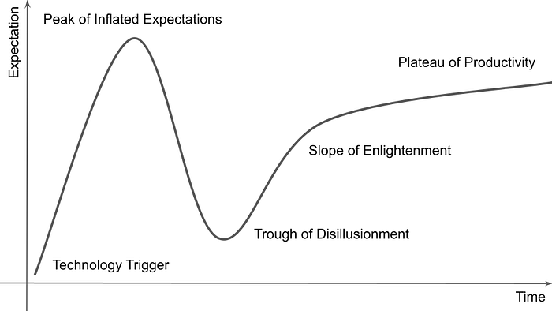
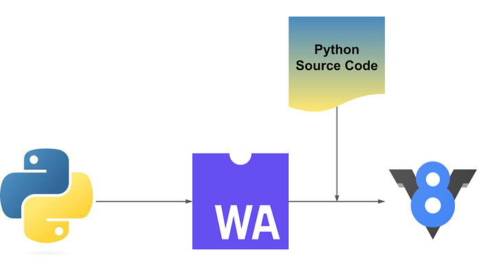
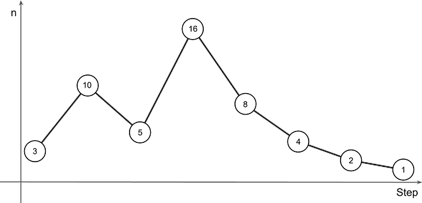

# I was understanding WASM all wrong!

> **Source:** [I was understanding WASM all wrong! 🤯 | by Yuji Isobe](https://medium.com/@yujiisobe/i-was-understanding-wasm-all-wrong-e4bcab8d077c)

## _TL;DR_

- WASM is great for both **frontend and backend**, not just speeding up JavaScript in the browser.
- WASM on the backend works differently than **Foreign Function Interface** (FFI). WASM is designed to run faster and more efficiently.
- WASM's speed comes from its **low-level binary format**, simple memory model, and ahead-of-time compilation. This minimizes overhead, allowing performance close to native code.
- I used Rust and WASM to **optimize [ULID](https://github.com/ulid/spec)** generation in [wa-ulid](https://github.com/yujiosaka/wa-ulid). The result was a **40x speedup** over the [JavaScript version](https://github.com/ulid/javascript).
- **WASM files** are currently **larger than JavaScript**, which can be challenging. But as WASM toolchains and optimization techniques improve, WASM will become more practical for both backend and frontend apps.

## Introduction

As a developer, I often go through phases when exploring new tech, similar to the **[Gartner Hype Cycle](https://en.wikipedia.org/wiki/Gartner_hype_cycle)**. This cycle shows the typical path to adopting a new technology. In this post, I want to explain how I went from skeptical to excited, especially about using it to boost backend performance.



> _Gartner Hype Cycle_

WASM is a low-level instruction format. It's designed as a compilation target for languages like C, C++, and Rust. The main goal is enabling high-performance web applications. But it's also increasingly used on the server-side when performance is critical.

My WASM journey had ups and downs. It started with inflated expectations, then disappointment, but ended with a solid understanding and practical applications.

## Initial Misconceptions

When I first heard the buzz about WASM, I had high hopes. I thought WASM would let us smoothly integrate complex computations into web browsers. It seemed similar to how FFI let high-level languages execute machine code.

### What is FFI?

FFI lets code in one language directly call code in another language. It's used when performance is crucial and some logic is implemented in a low-level language like C or Rust. That low-level code is then called from higher-level languages like Python or JavaScript.

I thought WASM was like FFI, just a way to run machine-level code in a browser. This made sense because WASM compiles high-level languages to a low-level binary format. But I overlooked WASM's unique architecture and constraints.

### **Comparing WASM to FFI**

Seeing WASM as FFI made me miss what makes WASM different from traditional machine code. In FFI, there's often major overhead when switching between the host language and foreign function. Moving data between different memory layouts is also costly.

## **Reality Check**

As I explored WASM more, I started to see gaps between my initial expectations and the reality of using it.

### First Steps with WASM and Rust

I began experimenting with WASM using [wasm-bindgen](https://github.com/rustwasm/wasm-bindgen), a tool that helps WASM modules and JavaScript work together. My first example was simple:

```rust
use wasm_bindgen::prelude::*;

#[wasm_bindgen]
pub fn add(a: u32, b: u32) -> u32 {
    a + b
}
```

Using **[wasm-pack](https://github.com/rustwasm/wasm-pack)** with link-time optimization (LTO), this basic addition function compiled to a tiny 214-byte WASM module. Initially, this seemed to prove WASM could deliver compact and efficient code.

### **Discovering the WAT Format**

To better understand how such a small piece of code worked, I looked at the WAT (WebAssembly Text Format) version. **[WAT is a readable version of WASM binaries.](https://developer.mozilla.org/en-US/docs/WebAssembly/Understanding_the_text_format)** It's essential for debugging and optimizing WASM applications. Here's the WAT for the `add` function:

```rust
(module
  (type (;0;) (func (param i32 i32) (result i32)))
  (func (;0;) (type 0) (param i32 i32) (result i32)
    local.get 0
    local.get 1
    i32.add
  )
  (memory (;0;) 17)
  (export "memory" (memory 0))
  (export "add" (func 0))
)
```

This concise format shows WASM's efficiency for simple computational tasks — no extra overhead, just the core operations to perform the function.

### **The Impact of Adding Complexity**

I then modified the example by adding string operations to see the effect on module size:

```rust
use wasm_bindgen::prelude::*;

#[wasm_bindgen]
pub fn add(a: u32, b: u32) -> u32 {
    let a = a.to_string().parse::<u32>().unwrap();
    let b = b.to_string().parse::<u32>().unwrap();
    return a + b;
}
```


Despite doing the same math, this version produced a much larger 14.5KB WASM module. The WAT file grew to over 7,126 lines, reflecting the added complexity and overhead from handling strings.


> _1/3 of the WAT file after adding the string manipulation_

The [WebAssembly.Instance](https://developer.mozilla.org/ja/docs/WebAssembly/JavaScript_interface/Instance) constructor can only synchronously compile modules under 4KB. Larger modules must compile asynchronously. But it sounded impossible for me to keep WASM files to fit below such a limit.

## **Disillusionment**

A major challenge was the dramatic increase in WASM module size when adding features like string manipulation. The ballooning file size contradicted WASM's promise as a lightweight, efficient format.

### **Optimizing WASM Module Size**

To address these issues, I explored ways to optimize WASM module size. Here are some strategies to minimize the footprint of WASM applications:

- **Avoiding Panics**: Rust's panic handling adds overhead. Using `Option` and `Result` types manages errors efficiently and avoids the bloat of panics.
- **Limiting Use of Strings**: Dynamic string operations significantly increase WASM module size. Using integer or fixed-size data types keeps modules compact.
- **Link-Time Optimization (LTO)**: Enabling LTO in the Rust compiler reduces compiled WASM size by removing unused code and optimizing across crate boundaries.
- **Manual Tree Shaking**: While automated tree shaking is limited in the Rust-to-WASM pipeline, manually ensuring only necessary functions and dependencies are included mitigates bloat.

Despite these efforts, inherent challenges seemed unbeatable at times, especially with complex data types and operations common in higher-level programming tasks.

### **Dynamic Languages in WASM**

WASM's difficulties aren't unique to Rust. Other languages, particularly dynamic ones like Python, face even greater challenges. To see why, consider compiling a dynamic language to WASM:

1. **Compiling the Interpreter**: For Python, the entire interpreter must be compiled to WASM, not just the user's code. This includes all built-in functions and libraries the language supports.
2. **Executing Code**: Running Python code compiled to WASM means running an interpreter within an interpreter. This adds significant overhead and can result in large WASM binaries.



> _Python transpiler is compiled to WASM to transpile Python source in WASM to be executed in WASM runtime._

Even for Go, a statically typed compiled language, the minimum WASM file size is 2MB according to [Go Programming Language Wiki](https://zchee.github.io/golang-wiki/WebAssembly/).

### **Community Challenges**

My disillusionment echoed the wider developer community. Many articles discussed similar struggles:

- [Zaplib post-mortem](https://zaplib.com/docs/blog_post_mortem.html): This detailed a startup's choice to abandon WASM due to lack of performance enhancements and development complexity.
- [Tree-shaking, the horticulturally misguided algorithm](https://wingolog.org/archives/2023/11/24/tree-shaking-the-horticulturally-misguided-algorithm): This highlights the immaturity of tree-shaking in the WASM toolchain, a crucial process for reducing the final binary size by removing unused code.

These community experiences underscored the challenges of using WASM in its current state and provided a sobering counterpoint to the initial excitement.

## **The Turnaround**

As I navigated my disillusionment with WASM, a pivotal moment came when I found the **[h3](https://github.com/uber/h3-js)** library developed by Uber. This library, which includes implementations in several languages (C, Python, Java, JavaScript) and **[h3-js](https://github.com/uber/h3-js)** uses **[Emscripten](https://github.com/emscripten-core/emscripten)** to bridge JavaScript and WASM compiled from C.

### **Understanding h3**

The h3 is designed for geospatial indexing. It provides a way to index coordinates into a hexagonal grid. This system is particularly useful for applications with large geospatial datasets. One function I often use is `latLngToCell`, which converts latitude and longitude coordinates into a hexagonal grid cell identifier.

### **Performance Comparison**

To gauge h3-js performance, I benchmarked the C implementation against the JavaScript version using WASM. Luckily, their repositories already included benchmarking programs. Here are the results from my local M2 MacBookPro:


## **Exploring WASM's capabilities**

Motivated by the unexpected h3-js results, I decided to further explore WASM's capabilities. I compared its performance with JavaScript and FFI using a computational problem: the **[Collatz conjecture](https://en.wikipedia.org/wiki/Collatz_conjecture)**.

[GitHub - yujiosaka/wasm-and-ffi-performance-comparison-in-node: Compare performance between a Rust FFI and a Rust-compiled-to-WASM for the Collatz conjecture.](https://github.com/yujiosaka/wasm-and-ffi-performance-comparison-in-node)


### **What is the Collatz Conjecture?**

The Collatz conjecture, also known as the "3n + 1 problem", is a mathematical hypothesis involving a sequence defined as follows:

1. Start with any positive integer _n_.
2. If _n_ is even, divide it by 2.
3. If _n_ is odd, multiply it by 3 and add 1.
4. Repeat the process until _n_ becomes 1.



> _Collatz Conjuncture starting with n=3_

The conjecture states that no matter the starting n value, the sequence will always eventually reach 1.

### **Collatz Conjecture in JS, FFI, and WASM**

To compare performances, I implemented the conjecture in plain JavaScript, using FFI to call a Rust function, and directly in WASM. And I passed n = 670617279 as the input, which requires 986 steps to reach 1.

- **JavaScript**

```rust
function collatzSteps(n) {
    let counter = 0;
    while (n !== 1) {
        if (n % 2 === 0) {
            n /= 2;
        } else {
            n = 3 * n + 1;
        }
        counter++;
    }
    return counter;
}
```

- **Rust (FFI) and Rust (WASM)**

```rust
pub fn collatz_steps(mut n: u64) -> u64 {
    let mut counter = 0;
    while n != 1 {
        if n % 2 == 0 {
            n /= 2;
        } else {
            n = 3 * n + 1;
        }
        counter += 1;
    }
    return counter;
}
```

For more details, please take a look at [my repository](https://github.com/yujiosaka/wasm-and-ffi-performance-comparison-in-node). Here are the benchmarks with M2 MacBookPro:


These findings demonstrated that WASM could outperform both native JavaScript and FFI, particularly for computationally intensive tasks.

## **Deep Dive into WASM Performance**

After seeing WASM's impressive performance with h3-js and the Collatz conjecture, it became clear there was more to WASM than I initially grasped.

### **How WASM Differs from FFI**

The key to understanding WASM's efficiency lies in its design as a low-level binary instruction format. It's not only platform-agnostic but also optimized for execution speed and compactness unlike FFI, where high overhead can occur due to marshaling data between execution contexts and handling different memory models. This setup minimizes typical FFI overhead by ensuring:

- **Memory Management is Linear and Uniform**: WASM uses a single contiguous memory block, simplifying the interface with the host environment. This reduces costs associated with memory management in traditional FFI setups.
- **Binary Format Optimized for Execution**: The WASM binary format is designed for efficient decoding and execution by modern JIT (Just-In-Time) compilers. This allows performance closer to native machine code speeds without typical runtime interpretation penalties.

### **WASM's Backend Use Case**

The h3-js library findings and my Collatz conjecture experiments have led to a shift in how I view WASM's application landscape:

- **Backend Over Frontend**: While WASM was initially touted for web application potential, its strengths are particularly pronounced in backend and other non-browser environments with common computation-intensive like data processing, scientific computations, and real-time media encoding/decoding.
- **Edge Computing**: WASM is ideally suited for edge computing applications, where running code closer to the data source can significantly improve response times and reduce bandwidth usage.

## **Optimizing ULID Generation Using WASM**

One practical application where I leveraged WASM's performance was generating **[Universally Unique Lexicographically Sortable Identifiers (ULIDs)](https://github.com/ulid/spec)**. ULIDs serve a similar purpose to UUIDs but are sortable. They consist of a timestamp and randomness component, encoded to ensure uniqueness and lexical sortability. This makes them particularly useful for distributed systems where sort order and uniqueness are critical.

### **40x Performance Increase**

By translating the existing JavaScript ULID generation implementation into Rust compiled to WASM, I achieved a significant performance boost — approximately 40 times faster than the original JavaScript version.

[GitHub - yujiosaka/wa-ulid: A high-performance ULID (Universally Unique Lexicographically Sortable Identifier) generator using WebAssembly, up to 40x faster than traditional implementations, optimized for backend use.](https://github.com/yujiosaka/wa-ulid)

This initial translation was straightforward but was followed by a more nuanced approach to further optimize performance.

### **Subsequent Optimization**

Initially, the performance improvement was around 10x faster. However, through several optimizations in the Rust implementation, I increased this to a 40x improvement. Here are the key techniques that contributed to this significant performance gain although they're not specific to WASM:

**1. Use of Efficient Data Structures**

Optimizing data structures used in the implementation, like using vectors with a pre-allocated capacity instead of dynamically resizing them, ensured that memory allocations were kept to a minimum and performance was not hindered by frequent memory operations.

```rust
// Before
String::new();
// After
String::with_capacity(len);
```


**2. Avoid Unnecessary Conversions and Memory Allocations**

The original Rust implementation involved unnecessary string and character conversions that were computationally expensive. By optimizing how data was handled and reducing memory allocation, performance was greatly improved. For example, using byte arrays directly instead of converting them to strings or characters whenever possible helped reduce overhead.

```rust
// Before
const ENCODING: &str = "0123456789ABCDEFGHJKMNPQRSTVWXYZ";

...

let mut chars = Vec::with_capacity(len);
for index in 0..len {
    chars.push(ENCODING.chars().nth(index).unwrap());
}

// After
const ENCODING: &str = "0123456789ABCDEFGHJKMNPQRSTVWXYZ";
const ENCODING_BYTES: &[u8] = ENCODING.as_bytes();

...

let mut chars = Vec::with_capacity(len);
for index in 0..len {
    chars.push(ENCODING_BYTES[index] as char);
}
```


**2. Precompute and Cache Computations**

Precomputing values that would be used repeatedly across function calls, such as powers of the encoding length, and caching them, reduced the computational load significantly. This was especially effective for functions like `decode\_time` where operations are repetitive and predictable.

```rust
// Before
const ENCODING_LEN: usize = 32;
const TIME_LEN: usize     = 10;

...

for i in 0..TIME_LEN {
    time += i as f64 * (ENCODING_LEN as u64).pow(index as u32) as f64;
}

// After
const ENCODING_LEN: usize = 32;
const POWERS: [f64; 10]   = [1.0, 32.0, ..., 35184372088832.0];

...

for i in 0..TIME_LEN {
    time += i as f64 * POWERS[index];
}
```

## **Conclusion**

The optimization of ULID generation using WASM exemplifies how understanding and leveraging WASM's capabilities can lead to substantial performance improvements in practical applications. This case study is just one example of how WASM can be effectively utilized not only in backend systems, where performance and efficiency are crucial, but also holds significant promise for the web as toolchains evolve.

Currently, the challenge of large binary sizes somewhat limits the use of WASM in front-end applications, where download and execution speed are critical. However, this is not a permanent limitation but rather a current hurdle. As WASM toolchains become more advanced in techniques like tree shaking and optimizing binary output, we can expect these binary sizes to shrink significantly.

The future of WASM on the web looks promising. As toolchains evolve and improve their ability to produce smaller, more efficient binaries, WASM's potential to revolutionize web performance and capability grows. This will not only enhance backend applications but could radically transform how complex applications are deployed and run in browser environments, making them as efficient and powerful as their native counterparts.

